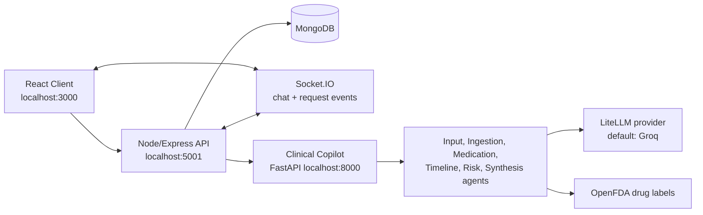

# MediConnect

MediConnect is a full-stack healthcare coordination platform for patients, doctors, and admins. Its core differentiator is **Clinical Copilot**, a Python/FastAPI multi-agent AI service that turns clinical documents into structured reports, SOAP notes, medication findings, timelines, and risk flags.

> Clinical Copilot is for educational and demonstration use. It does not provide medical advice, diagnosis, or treatment.

---

## What MediConnect Does

- Helps patients find approved doctors by ZIP code and specialization.
- Lets patients book appointments from doctor availability.
- Provides approval-based real-time messaging between patients and doctors.
- Gives doctors tools to manage profiles, appointments, and availability.
- Gives admins a doctor approval workflow.
- Runs uploaded clinical charts through **Clinical Copilot** for AI-assisted chart review.



---

## Clinical Copilot

Clinical Copilot is the main AI subsystem in MediConnect. It accepts PDF, DOCX, TXT, or Markdown clinical documents, extracts chart text, normalizes it, and runs a multi-agent pipeline.

### Agent Pipeline

1. **Input Agent** normalizes raw chart text into a structured clinical format.
2. **Ingestion Agent** validates, cleans, and chunks clinical text.
3. **Medication Agent** extracts medications and checks OpenFDA drug label warnings.
4. **Timeline Agent** reconstructs clinical events chronologically.
5. **Risk Agent** detects critical vitals, lab values, diagnoses, and safety flags.
6. **Synthesis Agent** produces SOAP notes, summaries, doctor reports, and patient-facing reports.

Medication and timeline analysis run in parallel where possible. Risk analysis waits for medication findings, and synthesis waits for all upstream agent outputs.

### Copilot Outputs

- Doctor-facing markdown report
- Patient-facing plain-language report
- SOAP note
- Prioritized red flags
- Medication list
- Drug warning/interactions from OpenFDA labels
- Timeline events
- Trace ID for each pipeline run

### Supported Uploads

| Type | Notes |
|------|-------|
| PDF | Uses `pdfplumber`, with `pypdf` fallback |
| DOCX / DOC | Extracts paragraphs and table cells |
| TXT / MD | Reads UTF-8 text directly |
| Size limit | 10 MB per file |

---

## Tech Stack

| Layer | Technology |
|-------|------------|
| Frontend | React 19, React Router, Axios, Socket.IO Client, React Dropzone, React Markdown |
| Backend API | Node.js, Express, Mongoose, JWT, Passport Google OAuth, Socket.IO, Multer |
| Database | MongoDB / MongoDB Atlas |
| Clinical Copilot | Python, FastAPI, LiteLLM, pdfplumber, pypdf, python-docx |
| AI integrations | Groq by default through LiteLLM; OpenFDA for drug label warnings |

---

## Project Structure

```text
MediConnect/
├── client/
│   ├── public/
│   └── src/
│       ├── components/
│       │   ├── Admin/
│       │   ├── Auth/
│       │   ├── Chat/
│       │   ├── Common/
│       │   ├── Doctor/
│       │   └── Patient/
│       │       └── ClinicalCopilot/
│       └── styles/
├── server/
│   ├── controllers/
│   ├── middleware/
│   ├── models/
│   └── routes/
└── clinical-copilot/
    ├── agents/
    ├── api/
    ├── orchestrator/
    ├── shared/
    └── tests/
```

---

## Prerequisites

- Node.js 18+
- Python 3.10+
- MongoDB local instance or MongoDB Atlas cluster
- Groq API key, or another LiteLLM-supported provider key
- Optional: Google OAuth credentials
- Optional: Gmail app password for OTP and approval email flows

---

## Environment Setup

### 1. Server

```bash
cd server
npm install
```

Create `server/.env`:

```env
PORT=5001
MONGO_URI=mongodb+srv://<user>:<password>@<cluster>.mongodb.net/mediconnect
JWT_SECRET=replace_with_a_long_random_secret

# Optional Google OAuth
GOOGLE_CLIENT_ID=
GOOGLE_CLIENT_SECRET=

# Optional email support
GMAIL_USER=
GMAIL_PASS=

# Clinical Copilot service URL
COPILOT_API_URL=http://localhost:8000
```

Start the server:

```bash
npm start
```

### 2. Clinical Copilot

```bash
cd clinical-copilot
python3 -m venv .venv
source .venv/bin/activate
pip install -r requirements.txt
cp .env.example .env
```

Edit `clinical-copilot/.env`:

```env
GROQ_API_KEY=your_groq_key_here
LLM_MODEL=groq/llama-3.3-70b-versatile
```

Start Clinical Copilot:

```bash
uvicorn api.main:app --reload --port 8000
```

Health check:

```bash
curl http://localhost:8000/health
```

Expected response:

```json
{ "status": "ok", "service": "ClinicalCopilot", "version": "2.0.0" }
```

### 3. Client

```bash
cd client
npm install
npm start
```

Open [http://localhost:3000](http://localhost:3000).

---

## Running the Full App

Use three terminals:

| Terminal | Directory | Command | URL |
|----------|-----------|---------|-----|
| 1 | `server/` | `npm start` | http://localhost:5001 |
| 2 | `clinical-copilot/` | `uvicorn api.main:app --reload --port 8000` | http://localhost:8000 |
| 3 | `client/` | `npm start` | http://localhost:3000 |

Clinical Copilot must be running for upload, normalize, and analyze workflows to work.

---

## App Routes

| Role | Route | Purpose |
|------|-------|---------|
| Public | `/` | Login |
| Public | `/register` | Register patient or doctor |
| Public | `/oauth-success` | Google OAuth callback landing |
| Patient | `/patient/profile` | Profile and appointments |
| Patient | `/patient/find-doctor` | Doctor search |
| Patient | `/patient/book-appointment` | Appointment booking |
| Patient | `/patient/diagnosis` | Clinical Copilot |
| Doctor | `/doctor/profile` | Doctor profile |
| Doctor | `/doctor/appointments` | Availability and appointments |
| Doctor | `/doctor/copilot` | Clinical Copilot |
| Admin | `/admin` | Doctor approval dashboard |
| Patient/Doctor | `/chats` | Messages |

---

## API Overview

### Node API

| Prefix | Key endpoints |
|--------|---------------|
| `/api/auth` | `POST /register`, `POST /login`, `POST /send-otp`, `POST /verify-otp`, Google OAuth |
| `/api/patient` | `GET /profile/me`, `PUT /profile/me`, `GET /findDoctors/:zip`, `/copilot/*` |
| `/api/doctor` | `GET /profile/me`, `PUT /profile/me`, `/copilot/*` |
| `/api/appointments` | `POST /doctor/availability`, `GET /doctor/slots/:doctorId`, `POST /book` |
| `/api/chat` | `POST /start`, `PUT /approve/:chatId`, `GET /user/:userId`, messages |
| `/api/admin` | `GET /pending-doctors`, `GET /all-doctors`, `POST /approve-doctor` |

### Clinical Copilot Proxy Routes

The Node API proxies Copilot requests through role-specific routes:

```text
POST /api/patient/copilot/upload
POST /api/patient/copilot/normalize
POST /api/patient/copilot/analyze

POST /api/doctor/copilot/upload
POST /api/doctor/copilot/normalize
POST /api/doctor/copilot/analyze
```

### Clinical Copilot Service

| Method | Endpoint | Purpose |
|--------|----------|---------|
| `GET` | `/health` | Service health |
| `POST` | `/upload` | Extract text from uploaded clinical file |
| `POST` | `/normalize` | Normalize raw chart text |
| `POST` | `/analyze` | Run full multi-agent analysis |

Example `/analyze` payload:

```json
{
  "patient_id": "PATIENT-001",
  "text": "Clinical note text..."
}
```

Example response fields:

```json
{
  "trace_id": "uuid",
  "doctor_report": "markdown",
  "patient_report": "markdown",
  "soap_note": {},
  "red_flags": [],
  "summary": "",
  "medications": [],
  "interactions": [],
  "timeline_events": [],
  "risk_flags": []
}
```

---

## Verification

Run these checks after setup or before a demo:

```bash
# Frontend production build
cd client
npm run build

# Server syntax check
cd ..
find server -name '*.js' -not -path '*/node_modules/*' -print0 | xargs -0 -n1 node --check

# Clinical Copilot compile check
find clinical-copilot -name '*.py' -not -path '*/.venv/*' -print0 | xargs -0 python3 -m py_compile

# Clinical Copilot import check
python3 - <<'PY'
import sys
sys.path.insert(0, 'clinical-copilot')
from api.main import app
print(app.title, app.version)
PY
```

Optional full Copilot case runner:

```bash
cd clinical-copilot
python tests/run_all.py
```

The full case runner calls LLM providers and can take time, consume quota, or hit rate limits.

---

## Clinical Safety Notes

Clinical Copilot output should be treated as assistive draft material only.

- Verify all findings against source documents.
- Do not use generated reports as the sole basis for diagnosis or treatment.
- Review red flags, medication findings, and summaries with a licensed clinician.
- Avoid uploading real patient data unless you have the right privacy, consent, and security controls in place.

---

## Development Notes

- Doctor accounts must be approved by an admin before login succeeds.
- Chat requests start as `pending`; doctors can approve them before messaging.
- Socket.IO is used for live chat messages and chat request updates.
- The server honors `PORT` from `server/.env`.
- Clinical Copilot defaults to `http://localhost:8000`; override with `COPILOT_API_URL`.
- Google OAuth callback is currently configured for local development on port `5001`.

---

## Author

**Atharv B** - [github.com/atharvb13](https://github.com/atharvb13)
